# StrictDoc Markup syntax highlighting using TextMate grammar in JSON format

This repository contains a TextMate grammar package that enables syntax
highlighting for the StrictDoc markup language.

[StrictDoc](https://github.com/strictdoc-project/strictdoc) is:

> Software for technical documentation and requirements management. 

## Demos

### Visual Studio Code

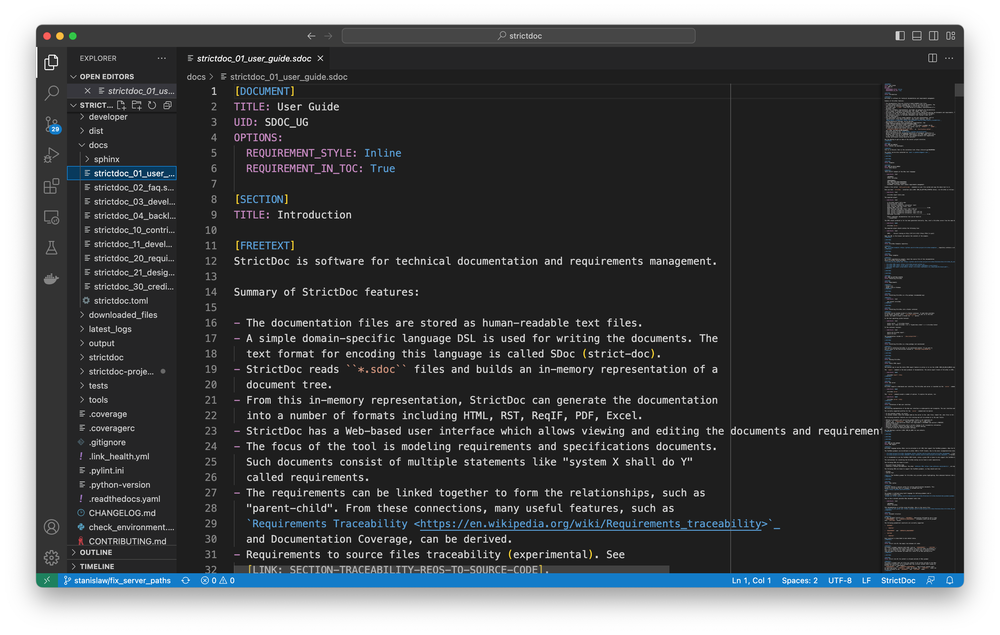

### PyCharm


### Eclipse

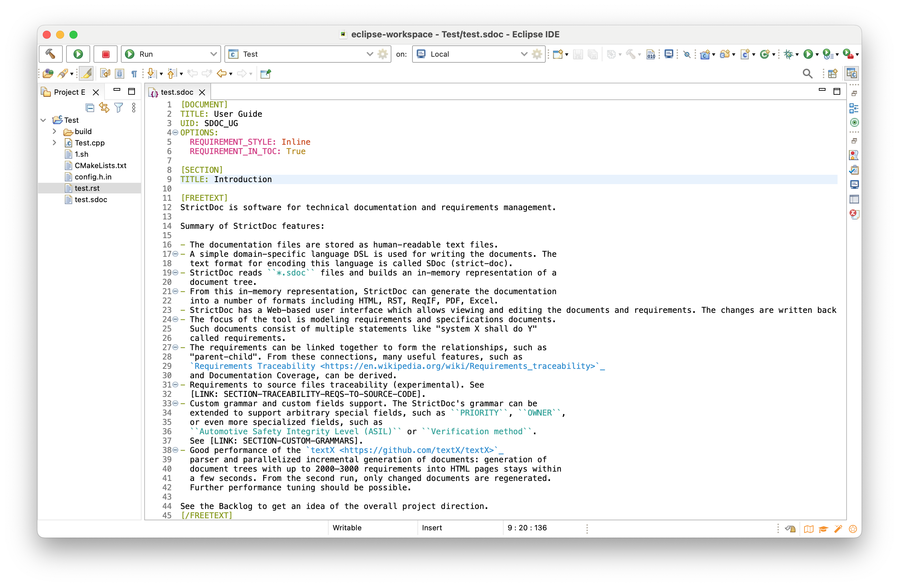

## Installing in Visual Studio Code (Visual Studio Marketplace)

The best way to get this extension up and running in Visual Studio Code
is to install it directly from the Marketplace:
[StrictDoc Language Basics Extension](https://marketplace.visualstudio.com/items?itemName=StrictDoc.strictdoc).

## Installing in Visual Studio Code (local installation)

It is also possible to install this extension manually by cloning this
repository.

Clone this repository to a good place under your file system:

```bash
git clone git@github.com:strictdoc-project/strictdoc.tmLanguage.git
```

Copy the cloned folder as-is to your user's VS Code extensions folder:

```bash
cp -rv strictdoc.tmLanguage $HOME/.vscode/extensions/
```

This instruction has been tested to work correctly and is taken from:
[Create Custom Language in Visual Studio Code](https://stackoverflow.com/q/30687783/598057).

The syntax highlighting should become activated right away, but you may need
to reload the editor / reopen the currently open tab with an `.sdoc` file.

## Installing in PyCharm

Clone this repository to a good place under your file system:

```bash
git clone git@github.com:strictdoc-project/strictdoc.tmLanguage.git
```

Go to `Preferences / Editor / TextMate Bundles`.

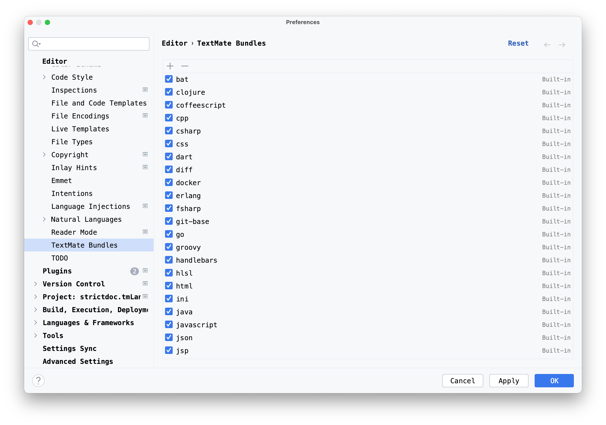

Click "+". Find and specify the `strictdoc.tmLanguage.git` folder. The folder
should appear in the list bundles. Note: the folder first appears at the bottom
of the list but then goes up when you open the `TextMate Bundles` next time.


When the settings are saved via `Apply` or `OK`, the syntax of all
open `.sdoc` files should become highlighted right away.

**Important:** When an SDoc file is opened for the first time, PyCharm
may attempt to associate the `.sdoc` extension with a Text file type.
Make you sure that the StrictDoc extension (`.sdoc`) is NOT registered
in `Editor / File types`. In particular, `.sdoc` shall not appear under `Text`
file type patterns, otherwise, the syntax highlighting for SDoc may not work.

## Installing in Eclipse

The Eclipse IDE for C/C++ Developers, version 2023-03 (4.27.0), was used to test
the steps of this tutorial. The syntax highlighting is expected to work in any
Eclipse-based IDE, as long as that IDE has the integrated
[TextMate support in Eclipse IDE (TM4E)](https://github.com/eclipse/tm4e>).

The steps are as follows.

### Create test files

In Eclipse, in your workspace, create two test files:
`test.rst` and `test.sdoc`. These files should help in testing
that both RST and SDoc markup work. Add some RST and SDoc content to these
files, for example:

```rst
Testing RST
===========

This is **a line** of RST.
```

```text
[DOCUMENT]
TITLE: Development Plan
OPTIONS:
  REQUIREMENT_STYLE: Table
  REQUIREMENT_IN_TOC: True

[FREETEXT]
Here, the RST markup shall be **recognized**.
[/FREETEXT]

[REQUIREMENT]
UID: GOAL-1-TOOL-SUPPORT
TITLE: Software support for writing requirements and specifications documents
STATEMENT: >>>
Here, the RST markup shall be **recognized**.
<<<
```

### Register .sdoc and .rst extensions

Go to `Eclipse / Preferences...` (`Command` + `,`). Open
`General / Content Types`. For the `Text` content type, add `*.sdoc` and `*.rst`
associations.

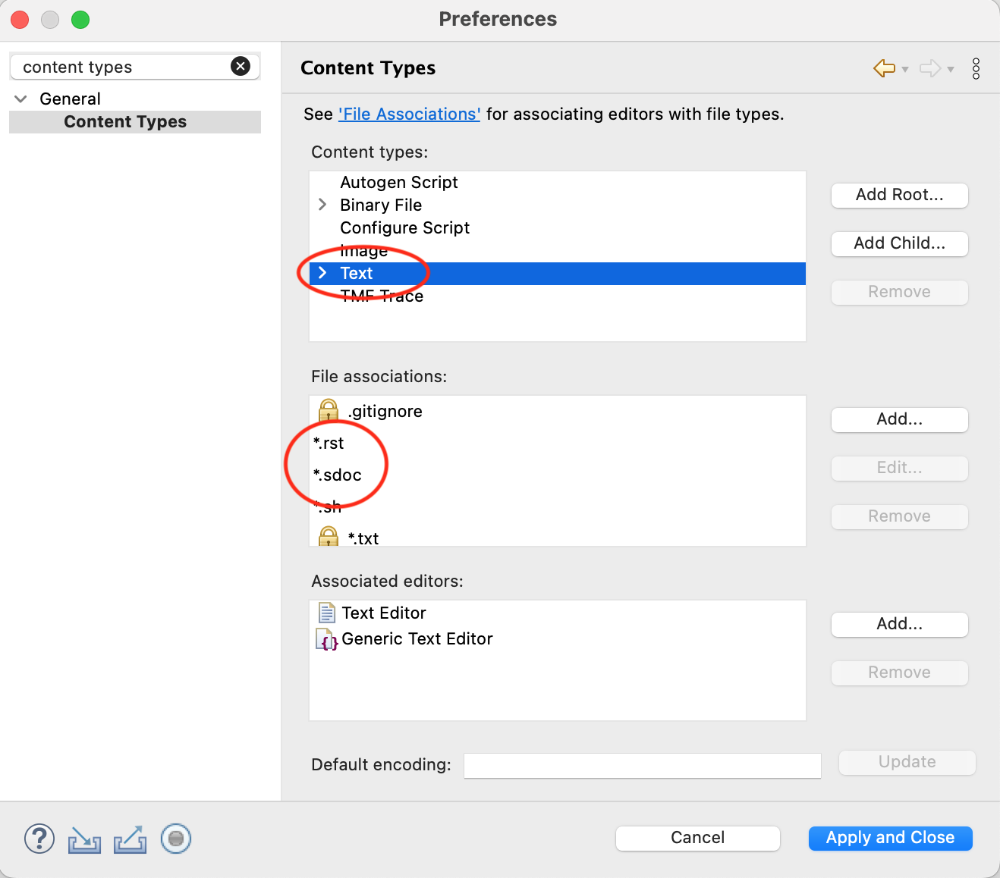

Notes:

1) It should be possible to create a `Text/StrictDoc` subcategory but the
basic combination shown on the screenshot is known to work.

### Register the RST syntax

If your Eclipse installation already has the RST syntax registered, you
don't need to register the `*.rst` extension, and this step can be skipped.

Eclipse TextMate grammar files are maintained in JSON format in the
[tm4e/org.eclipse.tm4e.language_pack](https://github.com/eclipse/tm4e/tree/main/org.eclipse.tm4e.language_pack)
folder.

Download the `rst.tmLanguage.json` file from GitHub:

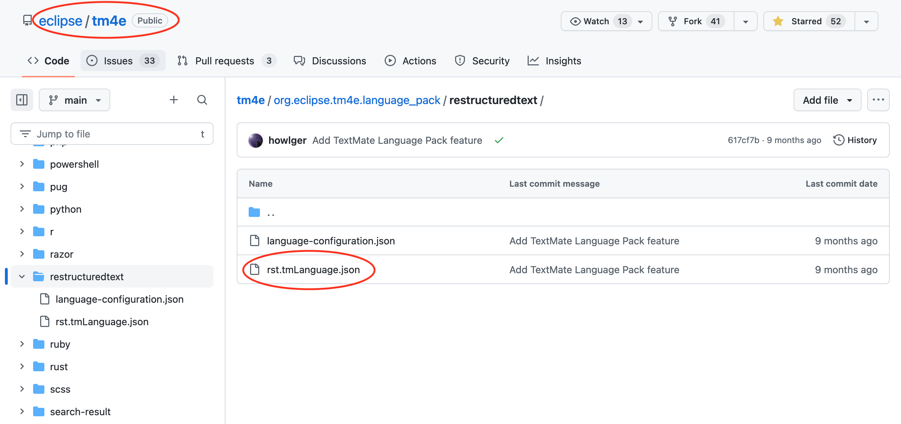

Open `Eclipse / TextMate / Grammar`, and add the RST grammar like is shown on
the screenshots:

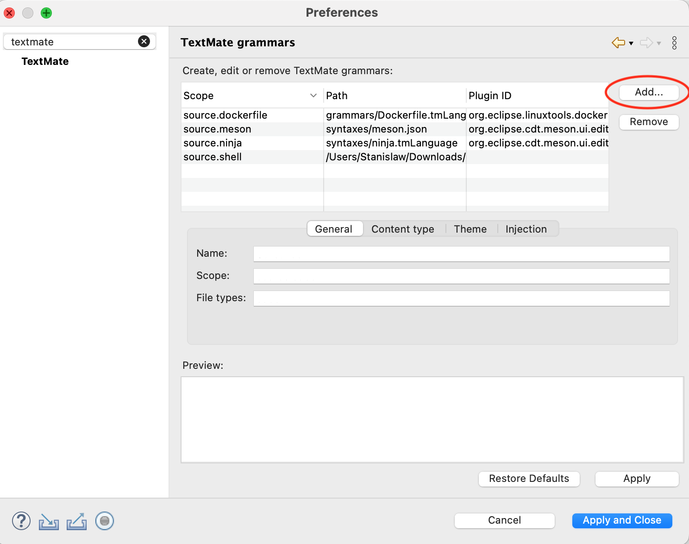
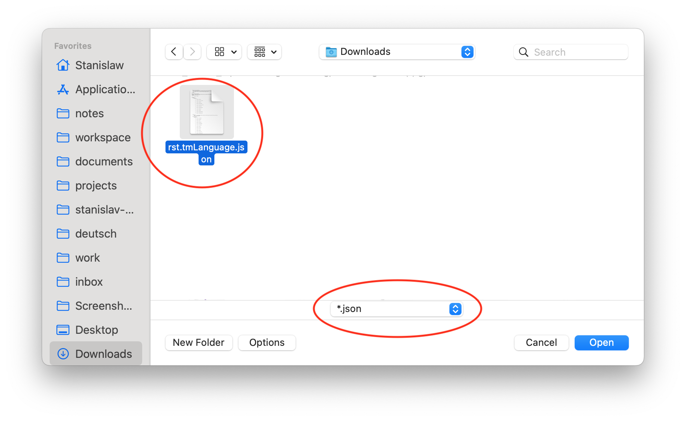
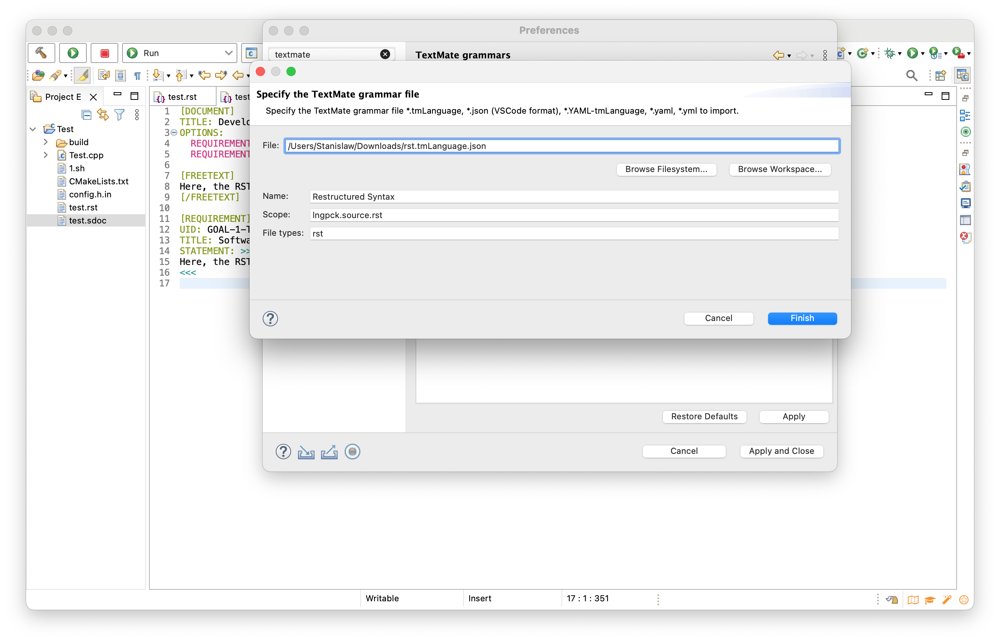

Click "Apply and Close" and open your `test.rst` file using the
`Generic Text Editor`:

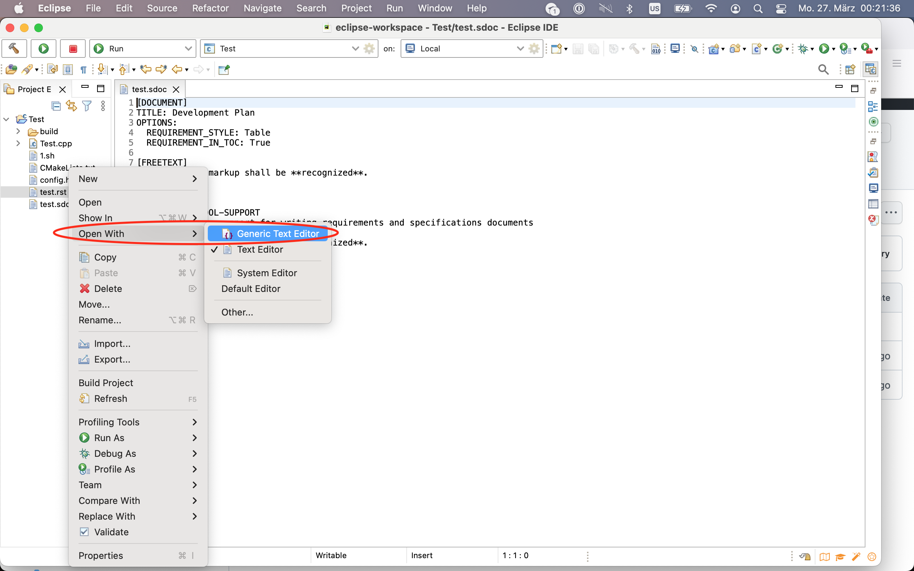

When the text editor tab is opened, your RST syntax should be highlighted:


### Register the SDoc syntax

Clone this repository to a good place under your file system:

```bash
git clone git@github.com:strictdoc-project/strictdoc.tmLanguage.git
```

In the cloned `strictdoc.tmLanguage` folder, there is a file called
`syntaxes/sdoc.tmLanguage.json`. Open that file and replace all occurrences of
`source.rst` with `lngpck.source.rst`. This is needed because TM4E language
repository maintains all its .json language files under the `lngpck.*`
namespace. Changing to `lngpck.source.rst` helps the StrictDoc grammar to
properly locate the RST grammar in Eclipse.

Follow the same steps as for RST above: import the `sdoc.tmLanguage.json` file.
The expected result:


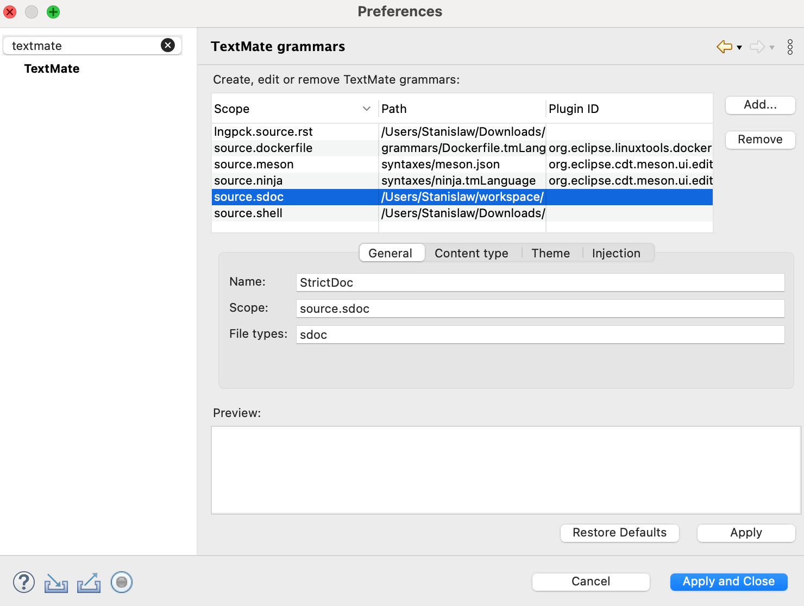

Now, open the `test.sdoc` file using the `Generic Text Editor`.

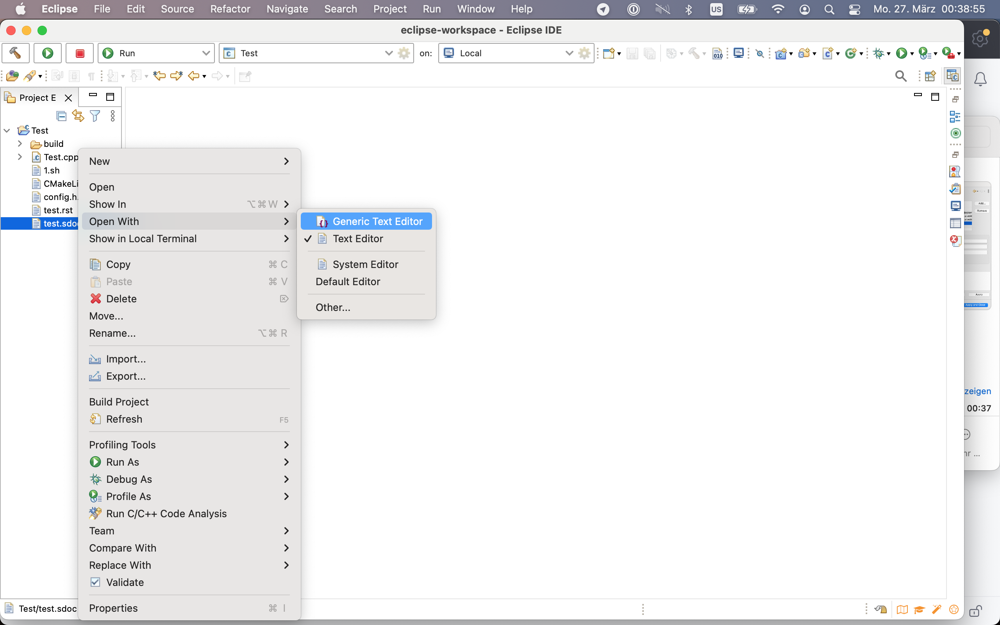

You should see the SDoc syntax highlighted:

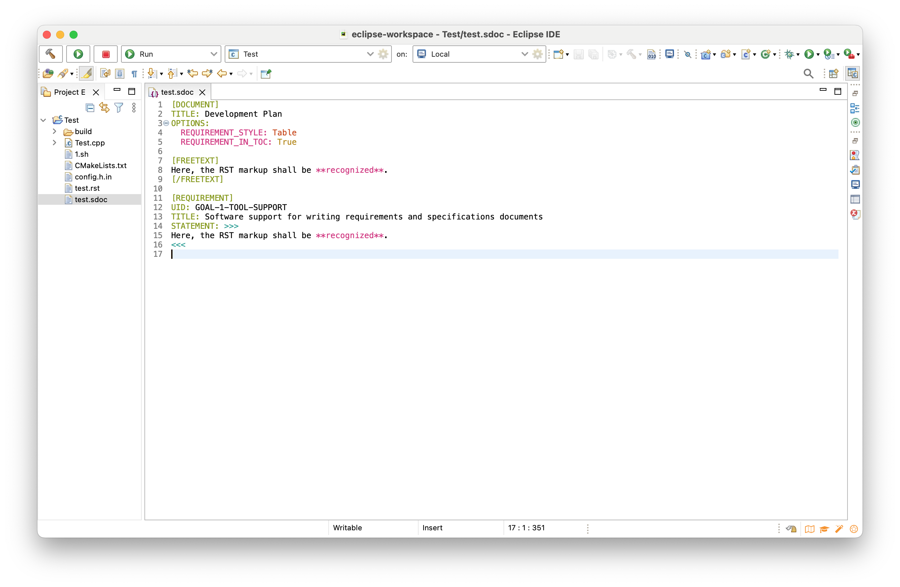
