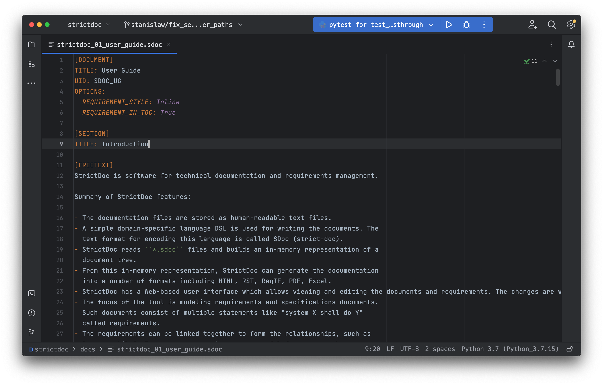

# StrictDoc Markup syntax highlighting using TextMate grammar in JSON format

This repository contains a TextMate grammar package that enables syntax
highlighting for the StrictDoc markup language.

[StrictDoc](https://github.com/strictdoc-project/strictdoc) is:

> Software for technical documentation and requirements management. 

## Demos

### Visual Studio Code


### PyCharm



## Installing in Visual Studio Code

Clone this repository to a good place under your file system:

```bash
git clone git@github.com:strictdoc-project/strictdoc.tmLanguage.git
```

Copy the cloned folder as-is to your user's VS Code extensions folder:

```bash
cp -rv strictdoc.tmLanguage $HOME/.vscode/extensions/
```

This instruction has been tested to work correctly and is taken from:
[Create Custom Language in Visual Studio Code](https://stackoverflow.com/q/30687783/598057).

The syntax highlighting should become activated right away, but you may need
to reload the editor / reopen the currently open tab with an `.sdoc` file.

## Installing in PyCharm

Clone this repository to a good place under your file system:

```bash
git clone git@github.com:strictdoc-project/strictdoc.tmLanguage.git
```

Go to `Preferences / Editor / TextMate Bundles`.


Click "+". Find and specify the `strictdoc.tmLanguage.git` folder. The folder
should appear in the list bundles. Note: the folder first appears at the bottom
of the list but then goes up when you open the `TextMate Bundles` next time.


When the settings are saved via `Apply` or `OK`, the syntax of all
open `.sdoc` files should become highlighted right away.
